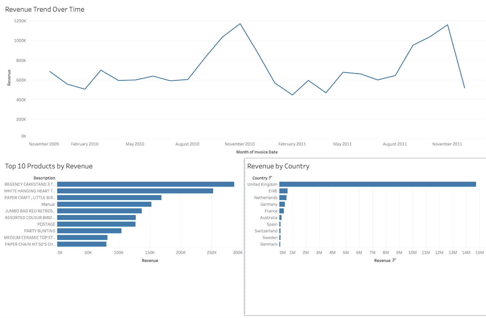

# E-Commerce Revenue and Customer Behavior Analysis

## Project Overview

This project analyzes over 1M e-commerce transactional records to identify 
revenue trends, product performance, customer behavior patterns, and 
geographic sales concentration. The goal was to transform raw transaction 
data into business insights that could support revenue strategy, inventory 
planning, and market expansion decisions.

The final deliverable is an interactive Tableau dashboard supported by 
Python-based data cleaning and transformation.

## Business Problem

How can an e-commerce business use transaction data to identify key 
revenue drivers, understand customer behavior, and optimize product and 
market strategy?

## Tools Used

- Python
- Pandas
- Tableau
- CSV data processing

## Data Cleaning and Preparation

The raw dataset was cleaned and transformed using Python and Pandas. Key 
preparation steps included:

- Removed invalid and incomplete transactions
- Filtered out canceled or negative-quantity orders
- Created revenue features from quantity and unit price
- Converted invoice dates into usable time-based fields
- Prepared the cleaned dataset for Tableau visualization

## Dashboard

The Tableau dashboard visualizes:

- Revenue trends over time
- Top-performing products by revenue
- Geographic revenue distribution
- Customer and transaction-level patterns

## Key Insights

- Revenue showed strong seasonal spikes in Q4, indicating holiday-driven 
demand patterns
- A small set of top-performing products contributed a disproportionate 
share of total revenue
- Revenue was heavily concentrated in a single market, highlighting 
geographic dependence and potential international expansion opportunities
- Final-period data appeared incomplete, preventing misleading 
interpretation of late-period revenue decline

## Business Recommendations

- Increase inventory and marketing activity before peak Q4 demand periods
- Prioritize high-performing products for promotions, pricing analysis, 
and inventory planning
- Explore growth opportunities in underperforming international markets
- Treat incomplete final-period data cautiously when analyzing time-series 
trends

## Files

- `cleaning_data.ipynb` — Python notebook used for cleaning and preparing the dataset
- `dashboard_screenshot.png` — screenshot of the final Tableau dashboard
- `sample_cleaned_retail.csv` — sample of the cleaned dataset used for dashboarding

Note: The full cleaned dataset and Tableau packaged workbook were not uploaded due to GitHub file size limits.

## What I Learned

This project strengthened my ability to clean large transactional 
datasets, identify business-relevant patterns, and communicate insights 
through Tableau dashboards. It also reinforced the importance of 
validating time-series completeness before making business conclusions.

